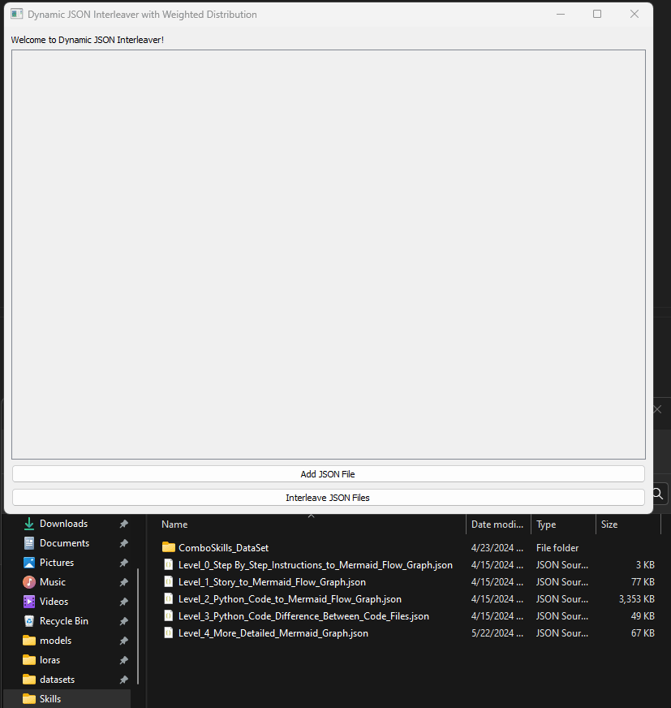

---

# Dynamic JSON Interleaver

## Overview
The Dynamic JSON Interleaver is a Python application utilizing PyQt5 for its graphical user interface (GUI). This tool allows users to load multiple JSON files and interleave their contents using a weighted distribution algorithm, ensuring proportional representation from each dataset based on its initial size. This tool is particularly useful for AI researchers and data scientists who need to merge datasets from different sources while maintaining balanced representation.

## Features
- **Dynamic File Loading**: Load an arbitrary number of JSON files.
- **Weighted Interleaving**: Merge datasets proportionally based on their sizes.
- **User-Friendly Interface**: Simple GUI for loading files and executing the interleaving process.
- **Robust Error Handling**: Manages file loading errors and JSON formatting issues gracefully.



## Installation
Ensure Python and PyQt5 are installed on your system:
```bash
pip install PyQt5
```
Run the application:
```bash
python interleave_jsons.py
```

## Usage
1. **Start the Application**: Execute the script to launch the GUI.
2. **Load JSON Files**: Click the 'Add JSON File' button to load one or more JSON files. Each loaded file will be listed in the application window.
3. **Interleave JSON Files**: Once at least two files are loaded, click the 'Interleave JSON Files' button to begin the interleaving process.
4. **Save the Interleaved File**: After interleaving, you will be prompted to save the resulting JSON file.

## Algorithm
### Weighted Interleaving Algorithm
The weighted interleaving algorithm is designed to merge multiple datasets into a single sequence, ensuring that each dataset is represented proportionally according to its size. This method is particularly crucial when datasets vary significantly in size, as it prevents smaller datasets from being overshadowed.

#### Detailed Steps:
1. **Weight Calculation**
   - **Initial Setup**: Upon loading the JSON files, the application counts the number of entries in each dataset to determine the total number of items across all datasets.
   - **Weight Assignment**: Each dataset is assigned a weight proportional to its size relative to the total count of items. For example, if one dataset contains 300 items and another contains 700 items, their initial weights would be 0.3 and 0.7, respectively.

2. **Selection and Interleaving Process**
   - **Random Selection Based on Weights**: At each step of the interleaving process, one dataset is randomly selected to provide the next item for the interleaved sequence. The probability of selecting any given dataset is determined by its current weight. Datasets with more remaining items have a higher probability of being selected, reflecting their larger initial sizes.
   - **Dynamic Adjustment of Weights**: As an item is removed from a dataset and added to the interleaved sequence, the total number of items decreases, and the size of the selected dataset decreases. Consequently, the weights are recalculated to reflect the new proportions of remaining items. This ensures that the selection process continually adjusts to the changing sizes of the datasets.
     - **Example**: If an item is taken from a dataset initially containing 700 items, its new size becomes 699, while the total number of items decreases to 999. The weights are recalculated as follows: 300/999 for the first dataset and 699/999 for the second.

### Why This Matters
- **Proportional Representation**: Ensures that each dataset contributes to the final interleaved sequence in a manner proportional to its size, maintaining the integrity and representativeness of the original data distributions.
- **Fairness and Balance**: By dynamically adjusting the selection probabilities as items are removed, the algorithm fairly balances the contributions of different datasets, preventing the premature exhaustion of smaller datasets.

## Technical Details
- **Python Version**: Python 3.x
- **Dependencies**: PyQt5
- **Platform Compatibility**: Cross-platform, tested on Windows, macOS, and Linux.

## Error Handling
The application robustly handles errors related to file operations and JSON formatting. Users are alerted to issues through dialog boxes, preventing the application from crashing and ensuring a smooth user experience.

## Contributing
Contributions to the Dynamic JSON Interleaver are welcome. Please fork the repository, make your improvements, and submit a pull request.

## License
This project is licensed under the MIT License

---
